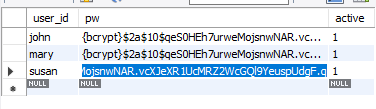

# Spring Security:

- Implemented using servlet filters in the background.
- Two methods to secure the app
    - Declarative 
    - Programmatic

Starter spring security 

```aidl
      <dependency>
          <groupId>org.springframework.boot</groupId>
          <artifactId>spring-boot-starter-security</artifactId>
          <scope>test</scope>
      </dependency>
```

## About the project:

The project files are similar to CRUD API tutorial - please refer to that for CRUD API info. The scripts used for the Database tables is under resources under src/main.


## Why servlet filters?

- They preprocess and postprocess all the web requests and responses. Thereby enabling rerouting of requests based on security logic.

## Authorization and Authentication

- Authentication checks if the user can see the protected web resource.

- Authorization says if the user is cleared (meaning they have a role) that can actually use the web resource.

### Authentication Methods:

**Basic Auth**

Basic Authentication is a method for an HTTP user agent (e.g., a web browser) to provide a username and password when making a request. When employing Basic Authentication, users include an encoded string in the Authorization header of each request they make.

## Declarative:

- All security constraints is defined in the Config file.
    - All java config files are annotated with @Configuration.
- Provides a separation of concern between application code and security.

Two classes - UserDetailsManager, UserDetails are used to manage your registered users.

### InMemoryUserDetailsManager:

DO NOT USE FOR ACTUAL PROJECTS.

The data is stored till the server runs, then it gets removed. Mostly used for demo's etc.

Build a user like this:

```aidl
UserDetails suvarna = User.builder()
                .username("suvarna")
                .password("{noop}test123")
                .roles("MANAGER", "EMPLOYEE")
                .build();
```

return an InMemoryUserDetailsManager like this:

```aidl
return new InMemoryUserDetailsManager(john, mary, suvarna);
```

with all the users added.

## Programmatic:

- It is where you define your own security handling. Spring provides security API that a dev can use to make custom security features.

### Database stored users:

Spring security will read user info from database.

IMP - you must follow spring security's predefined table schemas.

If you have just the defaults then there is no need to write JDBC/ JPA code but if you happen to involve some custom info then you need to write JDBC code to retrieve that info.

**DEFAULT SCHEMA**
```roomsql
// store users info
create table users(
	username varchar_ignorecase(50) not null primary key,
	password varchar_ignorecase(50) not null,
	enabled boolean not null
);

// respective roles
create table authorities (
	username varchar_ignorecase(50) not null,
	authority varchar_ignorecase(50) not null,
	constraint fk_authorities_users foreign key(username) references users(username)
);
create unique index ix_auth_username on authorities (username,authority);
```

Internally when spring stores roles associated with a specific user, it adds a prefix called "ROLE_"

```roomsql
INSERT INTO 'AUTHORITIES' VALUES ('john', 'ROLE_EMPLOYEE')
```

#### Custom Tables:

You do not have to use the default table schema present above.


## Spring Security Password Storage:

- A specific password storage format is used 

```aidl
{id}encodedPassword

where
id = is the type of encryption.
encodedPassword is the password that needs to be stored.

ex: {noop}test123

id = noop
encodedPassword = test123
```

Spring Security Team Recommendation: bcrypt algo

```java
{bcrypt}<hashvalue>
```

- Performs one way encrypted hashing
- Adds a random salt to the password for additional protection.

Passwords are stored with information about the type of algorithm used to derive them in the database



### JDBC

The current implementation you see under security is how you do it with low level JDBC code.

- Initialize JdbcUserDetailsManager 
- setUsersByUserNameQuery() method is invoked to get user details with the sql query being spent to it as argument.
- setAuthoritiesByUserNameQuery() method is invoked to get role details with the sql query being spent to it as argument.

it is important to define `WHERE` clause which looks up the username you send in the database table. 

example:

```roomsql
select * from members where user_id = ?
```

### Hibernate/ JPA - Use DAO 

[Hibernate example](notes/hibernate-spring-security.pdf)

### What the fuck is salt?

Salt is a cryptographically secure random string that is added to a password before it's hashed, and the salt should be stored with the hash, making it difficult for an attacker to know the original plaintext without having access to both sources

### Types of id:
1) noop - No encryption, passwords are stored as plain text.
2) bcrypt - Popular one way hashing function to encrypt passwords.

## SecurityFilterChain

This restricts the requests based on your user's role.

To find exact usage, please refer to - employeeSecurityConfig

requestMatchers("url").hasRole("ROLE")

url can be "/api/**" - which means all sub domains or "/api" which only points to that specific one.

## Watch-Out!:

- Adding a security dependency will make spring boot to automatically secure all the application endpoints.
- The default username is `user` and default password is autogenerated in the console.
- Once you define your users separately, spring will not take in the default username and password that you might provide with the application.properities file.