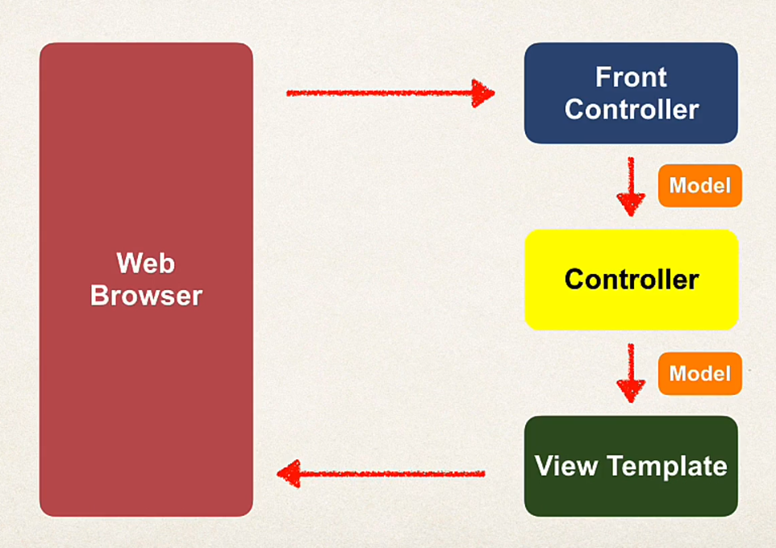

# Thymeleaf

Pronounced as tyme-leaf (h is silent)

They are placed in `main/resources/templates` folder and have `.html` extension.

You could place your static files under `resources/static` like CSS. 

Or if you use CDN, then directly link them to your thymleaf templates.

## Development process:

- Create a controller
- Create a thymeleaf template that a controller controls or returns.

### Spring MVC - behind the scenes



Front Controller aka DispatcherServlet that is provided by spring team that maps requests to their appropriate controllers.

### Controller 

It is important for controller classes to be annotated with @Controller.

It containes the business logic
  - Handle the request
  - Store/ retrieve data
  - Place data in the model.

Finally, send it to the appropriate view template. 

### Model

They are used to dynamically insert values into the thymeleaf template.

```java
public String getSomething(Model theModel) {
    theModel.addAttribute(<attribute-name-in-thymeleaf>, value);
}
```

You don't have to manually add data to the specific view like above. You could just take it from "param" object thats passed to a view if its present in the URL.

```java

import org.springframework.web.bind.annotation.RequestMapping;

\\ To see the real time example, see greetingController.

@RequestMapping("\showForm")
public String showForm() {
    return "helloWorldForm";    
}

@RequestMapping("\processForm")
public String showProcessedForm() {
    return "helloWorld";
}

```
### View 

Html templates

#### Thymeleaf tags

##### th:text
```

<p th:text="'this is awesome' + ${variable-insertion}"/>

```
##### th:href

@ symbol refers to the context path of my application. (app root)

```html
if I have a css file in /static/css
<link rel="stylesheet" th:href="@{/css/demo.css}"
```

##### th:action

Used in forms to direct where to send input parameters

```html
<form th:action="@{/processForm}">
    
</form>
```

#### thymeleaf read request data

1) Read through param object - see greetingController
2) Read through HttpServletRequest - see greetingsController.

