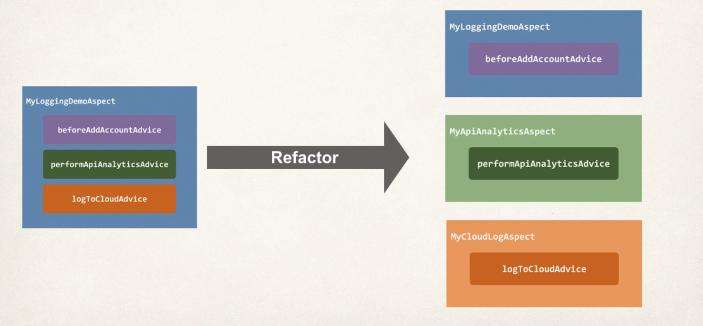

I have a pretty good introduction about AOP in crud_apis. Please do refer to it.

# AOP Terminology:

- Aspect: Module of code for a cross cutting concer (logging, security)
- Advice: What action is taken and when it should be applied
- Join point: When to apply code during program execution
- Pointcut: A predicate expression for where the advice should be applied

# Advice Types

- Before advice: run before the method
- After finally advice: run after the method (finally)
- After returning advice: run after the method (success execution)
- After throwing advice: run after method (if exception thrown)
- Around advice: run before and after method

# Weaving

Connecting aspects to target objects to create an advised object

- Different types of weaving
    - Compile time, load time or run time

Performance is the lowest with run time weaving

# AspectJ

Very first AOP framework that was released. Enables full support for all AOP advice types, pointcuts etc.

# Spring AOP

Spring uses run time weaving to advise objects!

You can convert them to AspectJ using @Aspect annotation

Only supports `Method-level` join points

# PointCut

Spring AOP uses AspectJ's pointcut expression language

- Execution Pointcuts :- Applies to execution methods

## Pointcut expression language:

```

execution(modifiers-pattern? return-type-pattern declaring-type-pattern? method-name-pattern(param-pattern) throws-pattern?)

```

fields with `?` is optional

### Examples

match method - addAccount from any class - with no arguments
```

execution(public void addAccount())

```

match method - updateAccount for a particular class

```

execution(public void com.bsn.tut.aop.repositories.AccountDAO.updateAccount())

```

match wildcard methods - addFakeAccount for a particular class

```

execution(public void add* ())

```

match method return type

```
The below pattern matches with any method that has any return type and also starts with count

execution(* count* ())

```

match method with parameter of Account class

```

Match on a method with only Account as the parameter

execution(* addAccount(com.bsn.tut.aop.entity.Account))

Match on a method with Account object as parameter and also any other parameters

.. -> wildcard for any param

execution(* addAccount(com.bsn.tut.aop.entity.Account, ..)

```

match method with any number of parameters

```

execution(* addAccount(..))

```

match any method that returns any type with any arguments 

basically match by package

```
After the * for return type
first * - any class
second * - any method

execution(* com.bsn.tut.aop.repositories.*.*(..))

```

## Pointcut Declarations:

This is used to reuse point cut expressions, that is multiple advices (aspect's methods) target a specific method (method we want the AOP to weave into)

```

link to code: loggingAspect.java:14

@Pointcut("execution(* declare* (..))")
private void declareAnything() {}; // mind this empty body

@Before("declareAnything()")
public void beforeDeclareWar() {
    System.out.println("AAAAAAAAA");
}

```

### Combining pointcut declarations:

- it works like if statements
- Execution happens only if it evaluates to true

```
pointcut that matches for both expressionOne declaration and expressionTwo declaration, that is, execute only if two of them are true
@Before("expressionOne() && expressionTwo()")

pointcut that executes when atleast one of them is true
@Before("expressionOne() || expressionTwo()")

pointcut that executes whenever expressionOne is true and excludes when expressionTwo is true.
@Before("expressionOne() && !expressionTwo()")

```

# Determining the order of execution of aspects:

- Spring randomly picks one aspect to run and there is no definite order built into the system.
- To go around this, consider refactoring code into different aspects instead of one. 
- Add `@Order`



## @Order

```

@Order(1)
public class MyCloudWhatever {
...
}

```

- Lower numbers have high precedence.
- Negative numbers are allowed, range is Integer.MIN_VALUE to Integer.MAX_VALUE.
- Does not have to be consecutive.
- If two aspects have same order then the order will become undefined again.

NOTE: You can group common pointcut expressions into a common class and that can be shared by other aspects. In this case, the @Aspect annotation is optional.

PITFALL: Remember that the classes that your aspects must weave themselves in must be annotated so they are picked up by spring container. If you initiate them like this

```java

// The aspects won't pick the methods executed this way
Downloader d = new Downloader();
d.downloadingLinux()

```

# JointPoints

You can access 
- Method signature 
- Method arguments

```

@Before("execution(public void addAccount(..))")
    public void beforeAddAccount(JoinPoint joinPoint){

        // Jointpoint to access method parameters and signature
        MethodSignature methodSignature = (MethodSignature) joinPoint.getSignature();

        System.out.println("Method: " + methodSignature);

        Object[] args_for_method = joinPoint.getArgs();

        for(Object temp: args_for_method) {
            // This String can be replaced with an entity and you could be use entity specific methods
            if(temp instanceof String) {
                temp = (String) temp;
                System.out.println("argument " + temp);
            }
        }
    }

```

# After Returning Advice:

This piece of aspect is executed after the method is finished executing and you would have to do something with the result


# Project setup

When starting a new project - select dependency `spring-boot-starter-aop`

If you want to add support for legacy project `@EnableAspectJAutoProxy`