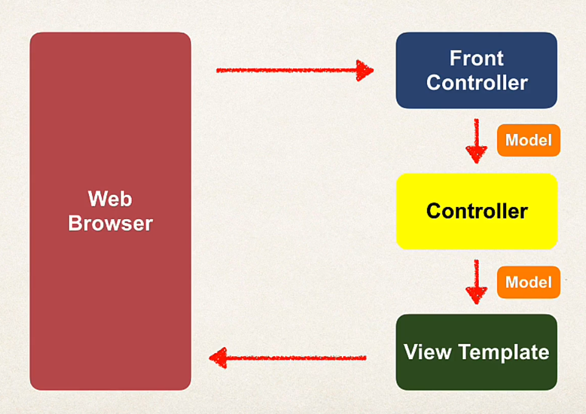

# Thymeleaf

Pronounced as tyme-leaf (h is silent)

They are placed in `main/resources/templates` folder and have `.html` extension.

You could place your static files under `resources/static` like CSS. 

Or if you use CDN, then directly link them to your thymleaf templates.

## Development process:

- Create a controller
- Create a thymeleaf template that a controller controls or returns.

### Spring MVC - behind the scenes



Front Controller aka DispatcherServlet that is provided by spring team that maps requests to their appropriate controllers.

### Controller

It is important for controller classes to be annotated with @Controller.

It containes the business logic
  - Handle the request
  - Store/ retrieve data
  - Place data in the model.

Finally, send it to the appropriate view template. 

#### @Value - annotation

It is used to extract values from the application.properities file. 

example: 

```java
@Value("${countries}")
private List<string> countries;
```

### Model

#### Add data to Spring MVC model

They are used to dynamically insert values into the thymeleaf template.

```java
public String getSomething(Model theModel) {
    theModel.addAttribute(<attribute-name-in-thymeleaf>, value);
}
```

You don't have to manually add data to the specific view like above. You could just take it from "param" object thats passed to a view if its present in the URL.

```java

import org.springframework.web.bind.annotation.RequestMapping;

\\ To see the real time example, see greetingController.

@RequestMapping("\showForm")
public String showForm() {
    return "helloWorldForm";    
}

@RequestMapping("\processForm")
public String showProcessedForm() {
    return "helloWorld";
}

```
### View 

Html templates

`${<variable-name>}` is used to extract value

#### Thymeleaf tags

##### th:text
```html

<p th:text="'this is awesome' + ${variable-insertion}"/>

```
##### th:href

@ symbol refers to the context path of my application. (app root)

```html
if I have a css file in /static/css
<link rel="stylesheet" th:href="@{/css/demo.css}"
```

##### th:action

Used in forms to direct where to send input parameters

```html
<form th:action="@{/processForm}">
    
</form>
```

##### th:value

Used to set value to the specific post request. Useful with forms.

**IMPORTANT** 

if the value has space then it must be placed within single quotes

```html

<input type="text" th:value="'Microsoft Windows'"> 

```

```html

<form>
    <select>
        <option th:value="brazil">
            Brazil
        </option>
    </select>
</form>
```

##### th:each

Creates an element multiple times.

```html

<form>
    <option th:each="country: ${countries}" th:value="${country}"></option>
</form>

```

#### thymeleaf read request data

1) Read through param object - see greetingController.
2) Read through HttpServletRequest - see greetingsController.
3) Read through @RequestParam - see greetingsControllerV3.

#### sending data 

When to use get and post?

| Get                        | Post                                           |
|----------------------------|------------------------------------------------|
| Good for debugging         | Can't be bookmarked or email URL               |
| Bookmark url or email url  | No limitations on data length                  |
| Limitations on data Length | Can also send binary data - pics, audio, video |

@RequestMapping can be used to target different request types like GET, POST, PUT etc

It then rejects any other request unless its the one specified.

```java

import org.springframework.web.bind.annotation.RequestMapping;
import org.springframework.web.bind.annotation.RequestMethod;

@RequestMapping(value = "/", method = RequestMethod.GET) // or .PUT etc

```

The above line can further be simplified into

```java

import org.springframework.web.bind.annotation.GetMapping;
import org.springframework.web.bind.annotation.PostMapping;
import org.springframework.web.bind.annotation.PutMapping;

@GetMapping("/")

@PostMapping("/thisIsFun")

@PutMapping("/update!")

//etc

```

#### Data Binding through Custom model - form data binding

see studentController example.

##### Tips 

`*{...}` is shortcut for `${student.firstName}`

## Spring MVC validation

Check out customer model, controllers for validation performance.

### dependency 

make sure to have "spring-boot-starter-validation" dependency

### Validation Annotations

- @NotNull - checks that the annotated value is not null. Basically a "required" tag to a field.
- @Min - must be a number >= value.
- @Max - must be a number <= value.
- @Size - size must match the given size.
- @Pattern - must match the given regular expression.
- @Future/@Past - Dates must be in the future or in the past.

### Steps involved:

1) Create a POJO with respect to the form - like customer form.
2) Insert the appropriate validation annotations corresponding to each field of the POJO.
3) Controller - Make sure to have 
   1) @Valid which triggers the validation to take place in the parameter
   2) BindingResult - class that indicates if there has been any error with respect to the validation.
   3) @ModelAttribute - Helps to retrieve information about the specific model that was added to the view.
        IMP: You would have to specify the model name in your method parameter if the model name is not similar to the class name it points to. Refer customer controller and student controller

### Filtering Controller Data:

(see customer controller class)

`@InitBinder` - it is used to pre-process every data that goes through our system. 

The method annotated with `@InitBuilder` must have a parameter called `WebDataBinder` which then invokes `registerCustomEditor()`(<data class type to be preprocessed>, <what is used to preprocess those data types with)

#### beans.propertyeditors

These are the editors to change the properities of your model attributes.

`StringTrimmerEditor` is a property editor that trims down extra white spaces in the value when we submit forms.

### Ranges

You could have two @Min and @Max validation annotation to specify a range.

### Regular Expressions

@Pattern(regex=<pattern>)

The string is matched with the above expression as a way to validate input.

### message.properities file

You can create a message.properities file to have your messages to be displayed if there is a specific exception.

For example, if you provide a string to integer field.

Some constraints:
   - this file has to be named "messages.properties".
   - this file has to be placed under resources.

### BindingResult 

You can print out the bindingResult using .toString() or inspect it in the debugger to find a wealth of information about offending fields during validation, they also reveal a field called `codes` that you can use in messages.properties file.

### Custom annotation - Create your own @!

see customer promoCode annotation - under validation folder

Process:
1) Create an interface with special annotation specific interface called `@interface`.
2) Add other relevant annotations on top of this interface, like
   1) @Constraint - Actual Implementation of our interface that would validate our field or execute business logic.
   2) @Target - Where do you want to apply this annotation?
      1) ElementType.METHOD - can be applied to methods
      2) ElementType.FIELD - can be applied to fields.
   3) @Retention - used to signify how long you want this to be present in the bytecode.
      1) RetentionPolicy.RUNTIME
3) 

### WATCHOUT - Required validation for Integer fields

If you use @NotNull for integer fields then make sure to use `Integer` instead of `int` or else you would get `unable to convert string to int primitive type`.

