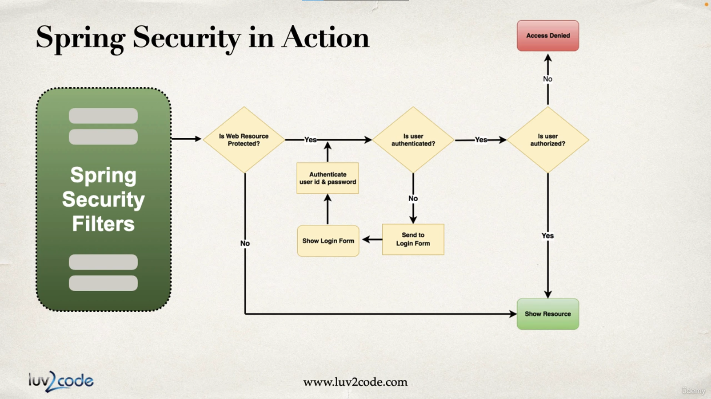

Check out API Security as well.

# Spring Security Model In Action



# Specifying our login page

```java

http.formLogin(
        form ->
            form
                .loginPage(<The url corresponding to the where the html points to>)
                .loginProcessingUrl(<Url where you plan to post to>)
                .permitAll()
        )

```

`loginProcessingUrl` provides automatic support for authentication and doesnt require us to specify a controller logic.

If the processing is performed automatically, then you have to let the default `name` be present for example: username must be `username` and password must be `password`.

Check out login.html

if the login fails then you can inform the user by checking if there is a `error` key in the url.

```html

th:if=${param.error}

```

# Logout

When you have to make a Logout request, then you must make a POST request with the help of a hidden form.

The specified `\(whatever-url-logout-action)` is taken care of my spring boot and you wouldn't have to code anything extra, just like login.

After the User performs logout, then spring boot invalidates the session and appends `?logout` to the end of the URL.

# Security Dialect - spring security with thymeleaf

The Spring Security dialect allows us to conditionally display content based on user roles, permissions or other security expressions. It also gives us access to the Spring Authentication object.

see home - it has examples on displaying user specific information.
`sec:authorize` and `sec:authentication`

```html
<div sec:authorize="hasRole('USER')">Text visible to user.</div>
<div sec:authorize="hasRole('ADMIN')">Text visible to admin.</div>
<div sec:authorize="isAuthenticated()">
    Text visible only to authenticated users.
</div>
Authenticated username:
<div sec:authentication="name"></div>
Authenticated user roles:
<div sec:authentication="principal.authorities"></div>
```


# Restricting URL based on Roles:

```java
in securityConfig

.requestMatchers("/").hasRole("<role>") ---> Checks if the authenticated user has the specific Role to access the resource.
        
.requestMatchers("/").hasAnyRole("<role1>", "<role2>") ---> Does the user have atleast one of these roles.

```

In my example, I have

role: Employee ---> `/home`
role: Manager ---> `/leaders` which employees cant access, only managers
role: Admin ---> `/admin` which manager or employee cant access

# Logging JDBC queries

edit application.properities file to include

```stuff

logging.level.org.springframework.jdbc.core=TRACE

```

# About this project:

The database scripts used are under the resources directory.